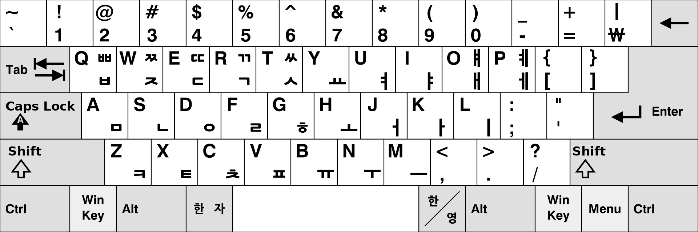

# 韓國語

配方： ℞ **`hangugeo`**

[Rime](https://rime.im) 韓國語輸入方案

漢字音來源：[MCPDict: 漢字古今中外讀音查詢](https://github.com/MaigoAkisame/MCPDict/tree/master/assets/databases/mcpdict.zip)

## 拼音方案

拼音方案基於[文化觀光部2000年式](https://zh.wikipedia.org/wiki/%E6%96%87%E5%8C%96%E8%A7%82%E5%85%89%E9%83%A82000%E5%B9%B4%E5%BC%8F)，但後者發音相同的韻尾不作區分。

爲了使諺文字符與編碼一一對應，本方案作如下調整：粗體部分顯示了修正與[文化觀光部2000年式](https://zh.wikipedia.org/wiki/%E6%96%87%E5%8C%96%E8%A7%82%E5%85%89%E9%83%A82000%E5%B9%B4%E5%BC%8F)相異的編碼

| 諺文 | ㄱ    | ㄲ     | ㄴ   | ㄷ    | ㄸ     | ㄹ   | ㅁ   | ㅂ    | ㅃ     | ㅅ    | ㅆ     | ㅇ   | ㅈ    | ㅉ     | ㅊ    | ㅋ   | ㅌ   | ㅍ   | ㅎ    |
| ---- | ----- | ------ | ---- | ----- | ------ | ---- | ---- | ----- | ------ | ----- | ------ | ---- | ----- | ------ | ----- | ---- | ---- | ---- | ----- |
| 初聲 | g     | **gg** | n    | d     | **dd** | r    | m    | b     | **bb** | s     | ss     | -    | **z** | **zz** | **c** | k    | t    | p    | h     |
| 終聲 | **g** | **gg** | n    | **d** | **dd** | l    | m    | **b** | **bb** | **s** | **ss** | ng   | **z** | **zz** | **c** | k    | t    | p    | **h** |

雙韻尾轉寫爲相應單輔音的組合，不考慮實際發音

| 諺文 | ㄳ   | ㄵ   | ㄶ   | ㄺ   | ㄻ   | ㄼ   | ㄽ   | ㄾ   | ㄿ   | ㅀ   | ㅄ   |
| ---- | ---- | ---- | ---- | ---- | ---- | ---- | ---- | ---- | ---- | ---- | ---- |
| 轉寫 | gs   | nz   | nh   | lg   | lm   | lb   | ls   | lt   | lp   | lh   | bs   |

元音不作調整

| 諺文 | ㅏ   | ㅐ   | ㅑ   | ㅒ   | ㅓ   | ㅔ   | ㅕ   | ㅖ   | ㅗ   | ㅘ   | ㅙ   | ㅚ   | ㅛ   | ㅜ   | ㅝ   | ㅞ   | ㅟ   | ㅠ   | ㅡ   | ㅢ   | ㅣ   |
| ------------------------------------------ | ---- | ---- | ---- | ---- | ---- | ---- | ---- | ---- | ---- | ---- | ---- | ---- | ---- | ---- | ---- | ---- | ---- | ---- | ---- | ---- | ---- |
| 轉寫                                       | a    | ae   | ya   | yae  | eo   | e    | yeo  | ye   | o    | wa   | wae  | oe   | yo   | u    | wo   | we   | wi   | yu   | eu   | ui   | i    |

## 輸入方案

如果直接按照拼音方案輸入，常見元音ㅕ的編碼長達3個字符，單字最長編碼更是長達7個字符(뗭, ddyeong)，另外大量出現的零聲母音節也容易和前一音節的韻尾粘連造成重碼，大大降低了輸入效率，因此建議使用以下三種輸入方案。

### 韓國語-羅馬字

schema_id: hangugeo_roma

在此方案中：

- 單輔音和單元音全部用一個字符編碼
- 零聲母的ㅇ也要求寫出
- 緊音兼容雙寫
- 雙元音遵從諺文形式的拼寫
- 含-y-介音可寫作主元音的大寫
- ㄹ兼容l/r兩種寫法

具體編碼如下表，粗體部分顯示了編碼與拼音方案不同的部分。

| 諺文 | ㄱ   | ㄲ     | ㄴ   | ㄷ   | ㄸ     | ㄹ   | ㅁ   | ㅂ   | ㅃ     | ㅅ   | ㅆ   | ㅇ   | ㅈ    | ㅉ     | ㅊ    | ㅋ   | ㅌ   | ㅍ   | ㅎ   |
| ---- | ---- | ------ | ---- | ---- | ------ | ---- | ---- | ---- | ------ | ---- | ---- | ---- | ----- | ------ | ----- | ---- | ---- | ---- | ---- |
| 編碼 | g    | **G**/gg | n    | d    | **D**/dd | r/l  | m    | b    | **B**/bb | s    | **S**/ss | **f** | z | **Z**/zz | c | k    | t    | p    | h    |

| 諺文 | ㅏ   | ㅐ    | ㅑ       | ㅒ       | ㅓ    | ㅔ   | ㅕ       | ㅖ       | ㅗ   | ㅘ     | ㅙ     | ㅚ       | ㅛ       | ㅜ   | ㅝ     | ㅞ     | ㅟ       | ㅠ       | ㅡ    | ㅢ     | ㅣ   |
| ---- | ---- | ----- | -------- | -------- | ----- | ---- | -------- | -------- | ---- | ------ | ------ | -------- | -------- | ---- | ------ | ------ | -------- | -------- | ----- | ------ | ---- |
| 編碼 | a    | **x** | **A**/ya | **X/yx** | **v** | e    | **V/yv** | **E**/ye | o    | **oa** | **ox** | **q/oi** | **O**/yo | u    | **uv** | **ue** | **w/ui** | **U**/yu | **j** | **ji** | i    |

### 韓國語-羅馬字快速

schema_id: hangugeo_fast

此方案基於上一方案，有如下優化：

- 參考標準두벌식鍵盤，常用雙元音ㅑㅕㅛㅠ單獨分配一個按鍵

  - | 諺文 | ㅑ   | ㅕ   | ㅛ   | ㅠ   |
    | ---- | ---- | ---- | ---- | ---- |
    | 編碼 | q    | w    | l    | y    |

- 受其影響

  - ㅚ/ㅟ只保留oi/ui拼寫
  - 含-y-介音的其他元音只能大寫
  - ㄹ只能拼作r
  
- 

### 韓國語-標準鍵盤

schema_id: hangugeo_stdkey

編碼由上一方案重映射至標準두벌식鍵盤

## 安裝

本方案依賴於

  - [朙月拼音](https://github.com/rime/rime-luna-pinyin) ℞ **`luna-pinyin`**

授權條款：見 [LICENSE](LICENSE)
